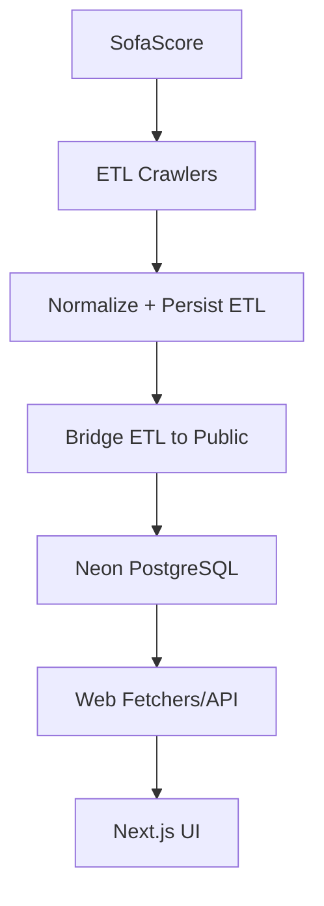

## Architecture Notes

O projeto adota arquitetura modular em monorepo, separando claramente ingestão de dados (ETL), apresentação (web) e contratos compartilhados (shared). A decisão principal de design é manter o schema Prisma centralizado em `packages/shared` para evitar drift entre serviços.

## System Architecture Overview

Topologia: monorepo com três módulos principais.

- `apps/etl`: coleta dados do SofaScore, normaliza e persiste em schema ETL/public.
- `apps/web`: consome dados (via ETL API e/ou banco) para renderização no frontend.
- `packages/shared`: Prisma client, schema e utilitários de cálculo/tipos.

Deploy model atual combina execução web (Vercel) e rotinas ETL automatizadas via GitHub Actions/scripts.

## Architectural Layers

- **Presentation Layer**: Next.js app (`apps/web/src/app`, `apps/web/src/components`)
- **Integration Layer**: fetchers/clients ETL (`apps/web/src/data`, `apps/web/src/lib/etl`)
- **Ingestion Layer**: crawlers e parser (`apps/etl/src/crawlers`, `apps/etl/src/parsers`)
- **Synchronization Layer**: bridge ETL → public (`apps/etl/src/bridge`)
- **Data Layer**: schema Prisma e client (`packages/shared/prisma`, `packages/shared/src/db`)

> See [`codebase-map.json`](./codebase-map.json) for complete symbol counts and dependency graphs.

## Detected Design Patterns

| Pattern                      | Confidence | Locations                                          | Description                                               |
| ---------------------------- | ---------- | -------------------------------------------------- | --------------------------------------------------------- |
| Pipeline por estágio         | 95%        | `apps/etl/src/index.ts`, `apps/etl/src/crawlers/*` | Coleta, normalização e persistência em etapas encadeadas. |
| Bridge / Data Sync           | 90%        | `apps/etl/src/bridge/etl-to-public.ts`             | Sincroniza schema ETL para schema de consumo.             |
| Shared Kernel                | 90%        | `packages/shared/*`                                | Reuso de tipos, schema e cálculo entre web e ETL.         |
| Boundary via package exports | 80%        | `packages/shared/package.json`                     | Fronteira explícita de módulos consumíveis.               |

## Entry Points

- `apps/etl/src/index.ts`
- `apps/etl/src/api/server.ts`
- `apps/web/src/app/layout.tsx`
- `apps/web/src/app/api/*`

## Public API

| Symbol                       | Type             | Location                             |
| ---------------------------- | ---------------- | ------------------------------------ |
| `@finalizabot/shared`        | package export   | `packages/shared/src/index.ts`       |
| `@finalizabot/shared/prisma` | package export   | `packages/shared/src/db/prisma.ts`   |
| `@finalizabot/shared/calc`   | package export   | `packages/shared/src/calc/market.ts` |
| ETL HTTP API                 | service endpoint | `apps/etl/src/api/server.ts`         |

## Internal System Boundaries

- Web não deve conhecer detalhes de crawler.
- ETL é dono da ingestão e normalização dos dados externos.
- Shared é dono do contrato de dados (Prisma schema/tipos/cálculo).
- Bridge é o ponto de tradução entre dados brutos e visão de consumo.

## External Service Dependencies

- SofaScore (fonte de dados primária via crawlers)
- Neon PostgreSQL (armazenamento principal)
- Clerk (autenticação no web)
- Vercel (hosting do web)
- GitHub Actions (CI + sync agendado)

## Key Decisions & Trade-offs

- Monorepo para reduzir drift entre web/etl/shared.
- Prisma centralizado para reduzir inconsistência de schema.
- ETL dedicado para isolamento de scraping de alto custo.
- Trade-off: mais acoplamento operacional entre sync e consumo.

## Diagrams

## Risks & Constraints

- Risco de escala no bridge por queries amplas e potenciais padrões N+1.
- Dependência de disponibilidade da fonte externa (SofaScore).
- Cobertura de testes ainda baixa para fluxos críticos ETL.
- Parte da documentação operacional ainda em convergência.

## Top Directories Snapshot

- `apps/web/`
- `apps/etl/`
- `packages/shared/`
- `.context/docs/`
- `scripts/`

## Related Resources

- [project-overview.md](./project-overview.md)
- [data-flow.md](./data-flow.md)
- [codebase-map.json](./codebase-map.json)
