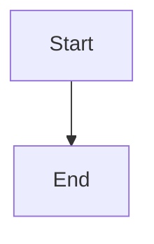

## Architecture Notes

<!-- Describe how the system is assembled and why the current design exists. -->

_Add descriptive content here._

## System Architecture Overview

<!-- Summarize the top-level topology (monolith, modular service, microservices) and deployment model. Highlight how requests traverse the system and where control pivots between layers. -->

_Add descriptive content here._

## Architectural Layers

<!-- List architecture layers with their purpose and key directories. Do NOT list symbol counts inline - reference codebase-map.json for detailed analysis. -->

- **Services**: Core business logic (`src/services/`)
- **Generators**: Content generation (`src/generators/`)

> See [`codebase-map.json`](./codebase-map.json) for complete symbol counts and dependency graphs.

## Detected Design Patterns

<!-- Table with Pattern, Confidence, Locations, and Description columns. Link to actual implementations. -->

| Pattern | Confidence | Locations | Description |
|---------|------------|-----------|-------------|
| Factory | 85% | `LLMClientFactory` | Creates LLM client instances |

## Entry Points

<!-- List entry points with markdown links to the actual files. -->

- _Item 1_
- _Item 2_
- _Item 3_

## Public API

<!-- Table of exported symbols with Symbol, Type, and Location columns. -->

| Column 1 | Column 2 | Column 3 |
|----------|----------|----------|
| _value_ | _value_ | _value_ |

## Internal System Boundaries

<!-- Document seams between domains, bounded contexts, or service ownership. Note data ownership, synchronization strategies, and shared contract enforcement. -->

_Add descriptive content here (optional)._

## External Service Dependencies

<!-- List SaaS platforms, third-party APIs, or infrastructure services. Describe authentication methods, rate limits, and failure considerations. -->

- _Item 1 (optional)_
- _Item 2_
- _Item 3_

## Key Decisions & Trade-offs

<!-- Summarize architectural decisions, experiments, or ADR outcomes. Explain why selected approaches won over alternatives. -->

_Add descriptive content here (optional)._

## Diagrams

<!-- Link architectural diagrams or add mermaid definitions showing system components and their relationships. -->

## Risks & Constraints

<!-- Document performance constraints, scaling considerations, or external system assumptions. -->

_Add descriptive content here (optional)._

## Top Directories Snapshot

<!-- List top directories with approximate file counts. -->

- _Item 1_
- _Item 2_
- _Item 3_

## Related Resources

<!-- Link to Project Overview and other relevant documentation. -->

- _Item 1_
- _Item 2_
- _Item 3_

## Related Resources

<!-- Link to related documents for cross-navigation. -->

- [project-overview.md](./project-overview.md)
- [data-flow.md](./data-flow.md)
- [codebase-map.json](./codebase-map.json)
