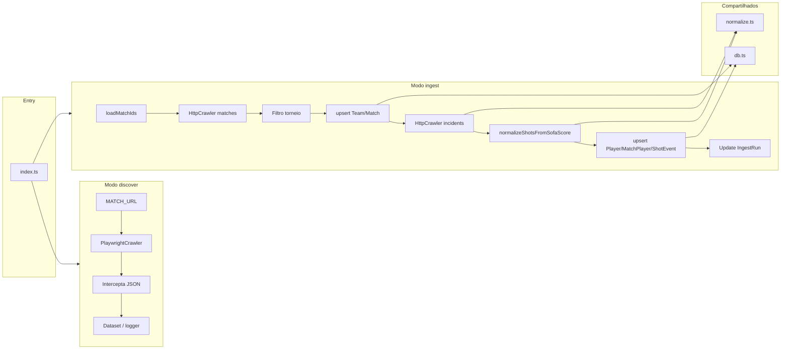

# Arquitetura

## Propósito do sistema

O SofaScore ETL é um pipeline que:

1. Consome a **API do SofaScore** (dados da partida e eventos/incidents).
2. **Normaliza** finalizações (shots) para um formato interno.
3. **Persiste** no PostgreSQL no schema `etl`, para uso pelo **FinalizaBOT** (e opcionalmente pela API deste projeto).

Todas as tabelas ficam no schema Postgres `etl`.

## Modos de execução

O ponto de entrada é `src/index.ts`, que lê a variável `MODE` e escolhe o fluxo:

| Modo | Como rodar | Descrição |
|------|------------|-----------|
| `discover` | `MODE=discover MATCH_URL="https://..." npm run dev` | Abre a URL com Playwright e intercepta respostas JSON para descobrir endpoints. |
| `ingest` | `npm run sync` ou `MODE=ingest npm run dev` | Carrega IDs de partidas, chama a API do SofaScore, filtra por torneio, normaliza e grava no banco. |
| (padrão) | `npm run dev` | Stub: inicia um CheerioCrawler vazio e encerra. |

## Fluxo do ingest

**Fase 1 (partidas principais)**  
1. **Carregar match IDs** — de `MATCH_IDS` (env), de `src/seed/matches.txt`, ou por **discovery**: partidas dos dias atual e posterior (hoje/amanhã em `SYNC_TZ`, configurável com `SYNC_DAYS`) nos torneios configurados.
2. **Crawler de partidas** — para cada ID, GET em `https://api.sofascore.com/api/v1/event/{matchId}` e lineups.
3. **Filtro de torneio** — `ALLOWED_TOURNAMENT_NAMES`: só partidas cujo torneio está na lista seguem.
4. **Upsert Team, Match, Player, MatchPlayer** — times, partida (tournament/season), jogadores e minutos jogados (lineups).
5. **Crawler de incidents** — para cada partida aprovada, GET em `.../event/{matchId}/incidents`.
6. **Parser** — `normalizeShotsFromSofaScore()` extrai e normaliza shots (outcome, xg, bodyPart, situation, etc.).
7. **Upsert Player, MatchPlayer e ShotEvent** — jogadores, vínculos e inserção de shots.

**Fase 2 (histórico para last-matches)**  
8. **Discovery últimos N dias** — partidas **finalizadas** nos últimos `SYNC_LAST_DAYS` dias (padrão 60) nos mesmos torneios.
9. **Ingest das partidas da Fase 2** — mesmo pipeline (event + lineups + incidents) para os IDs ainda não ingeridos, populando histórico para `GET /players/:id/last-matches`.

10. **Atualizar IngestRun** — status `success` ou `failed`.

Os serviços de banco (`db.ts`) e o parser (`normalize.ts`) são compartilhados pelo fluxo de ingest.

## Diagrama de fluxo

## Tecnologias

- **Runtime:** Node.js com TypeScript (tsx em dev, tsc para build).
- **Crawling:** Crawlee — HttpCrawler (ingest) e PlaywrightCrawler (discover).
- **Banco:** PostgreSQL; acesso via **Prisma** (schema `etl`, cliente em `generated/prisma`).
- **API:** **Fastify** (servidor opcional para consultar shots por jogador ou partida).
