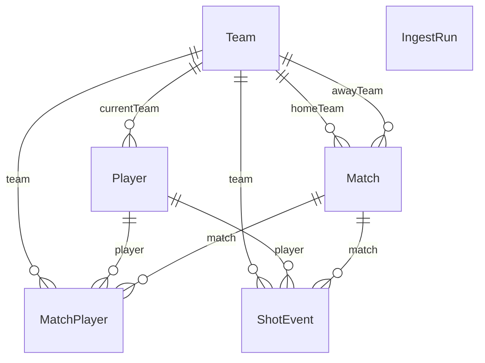

# Banco de dados

Todas as tabelas do ETL ficam no schema PostgreSQL **`etl`**. O Prisma está configurado para usar apenas esse schema.

## Entidades

| Modelo | Tabela | Descrição |
|--------|--------|-----------|
| **Team** | `etl.Team` | Time (id, name, slug). |
| **Player** | `etl.Player` | Jogador (id, name, slug, position, currentTeamId). |
| **Match** | `etl.Match` | Partida (id, tournament, season, startTime, homeTeamId, awayTeamId). |
| **MatchPlayer** | `etl.MatchPlayer` | Vínculo jogador–partida–time (matchId, playerId, teamId, minutesPlayed opcional). Chave composta (matchId, playerId). |
| **ShotEvent** | `etl.ShotEvent` | Evento de finalização (id, matchId, playerId, teamId, minute, second, type, outcome, xg, bodyPart, situation, coordsX, coordsY, createdAt). |
| **IngestRun** | `etl.IngestRun` | Registro de cada execução do ingest (id, startedAt, finishedAt, status, error). |

## Relações

- **Match** tem `homeTeam` e `awayTeam` (Team).
- **Match** tem muitos **MatchPlayer** e muitos **ShotEvent**.
- **MatchPlayer** pertence a uma **Match**, um **Player** e um **Team**.
- **ShotEvent** pertence a uma **Match**, um **Player** e um **Team**.
- **Player** pode ter `currentTeam` (Team) e tem muitos **MatchPlayer** e **ShotEvent**.
- **Team** tem muitos **Player** (currentTeam), **Match** (home/away), **MatchPlayer** e **ShotEvent**.
- **IngestRun** não tem relações com outras entidades.

## Diagrama ER (resumido)

## Índices

- **Match:** `homeTeamId`, `awayTeamId`, `startTime`.
- **MatchPlayer:** `playerId`, `teamId`.
- **ShotEvent:** `matchId`, `playerId`, `teamId`, `minute`, `(matchId, minute)`.
- **IngestRun:** `status`, `startedAt`.

Eles estão definidos em `prisma/schema.prisma` com `@@index`.

## Uso no código

- O cliente Prisma é importado em `src/services/db.ts` a partir de `generated/prisma` (caminho relativo ao output do generator no `schema.prisma`).
- `db.ts` expõe: `getPrisma()`, `upsertTeam()`, `upsertPlayer()`, `upsertMatch()`, `attachMatchPlayer()`, `insertShotEvents()`.
- O ingest em `src/crawlers/sofascoreIngest.ts` usa essas funções e também cria/atualiza `IngestRun` diretamente com o Prisma.
- A API em `src/api/server.ts` usa `getPrisma()` para consultar `ShotEvent` (com filtros por `playerId`, `matchId` e datas).

## Alterando o schema

1. Edite `prisma/schema.prisma` (novos modelos, campos ou índices).
2. Rode `npm run prisma:migrate` para criar e aplicar a migração.
3. Rode `npm run prisma:generate` para regenerar o cliente em `generated/prisma`.

O diretório `generated/prisma` está no `.gitignore` e não deve ser versionado.
